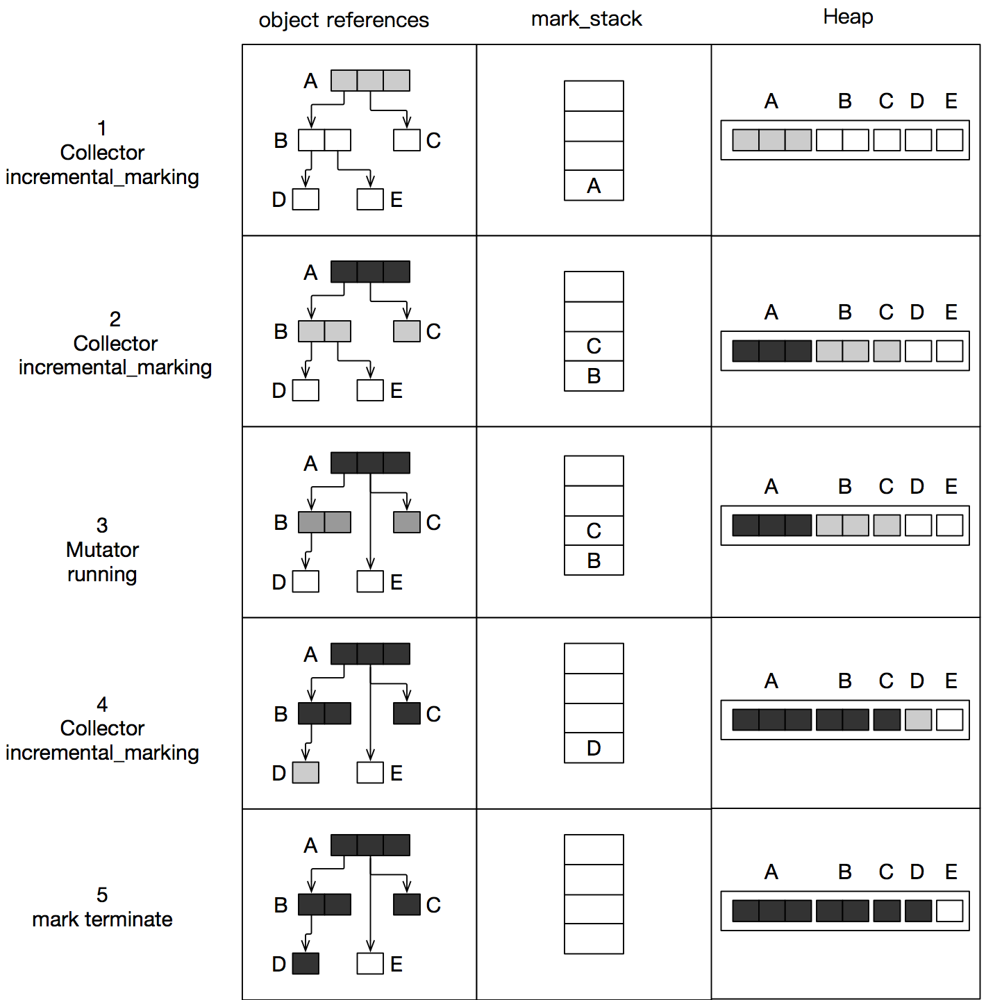
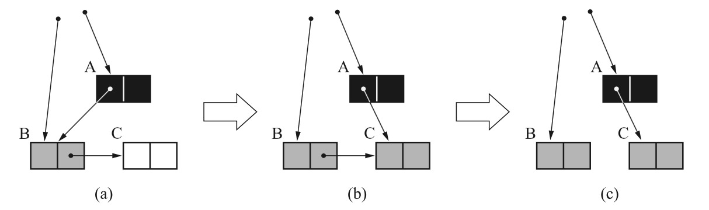
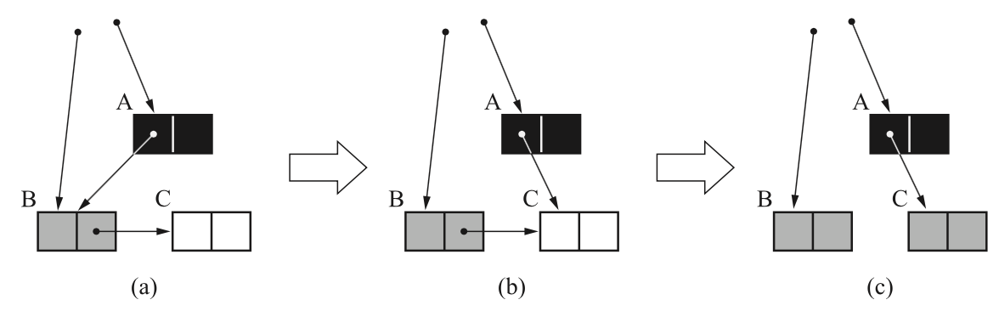

# 要解决的问题

* 如何解决并发垃圾回收导致的同步问题

# 解决方案

* 读屏障(read barrier)

* 写屏障(write barrier)

# 解决方案案例

## 三色标记清除算法中的 write barrier

在三色标记清除算法中，垃圾回收是增量进行的，期间 mutator 和 collector 并发执行。mutator 和 collector 同时读写共享变量（对象的引用关系图），如果不解决并发读写的数据同步问题，将导致活动对象被错误地回收。

### 为什么需要做同步

三色标记清除算法中将对象分为黑色、灰色、白色，黑色对象不能直接指向白色对象，即需要遵守三色不变性（tri-color invariant）。下面是 mutator 和 collector 并发执行中违反了三色不变性的例子：



三色标记清除算法中使用mark_stack暂存灰色对象。当 mark_stack 为空时，标记阶段结束，此时所有白色对象将被视为垃圾对象，在清除阶段会被回收。在第3个阶段中，mutator 将对象的指针引用做了更新，新增了 A 指向 E 的指针（新增了一个从黑色对象指向白色对象的指针），删除了 B 指向 E 的指针。如果这个阶段不做同步处理，则由于 A 已经遍历完成，不会再次被加入 mark_stack 。collector 继续从 mark_stack 中获取对象 C、B 进行遍历，可以遍历到 D，因此 D 能被正确标记。但是已经无法遍历到 E，因此 E 在遍历结束时是白色。清除阶段，E 将会被当作垃圾对象进行回收。但是实际上 A 还在引用 E，所以可能引发程序 bug。

因此，在 mutator 运行期间，如果出现新增黑色对象指向白色对象的指针，则需要进行干预，额外插入一段数据同步的代码。

### 写入屏障

写入屏障发生在垃圾回收过程的标记阶段, 当 mutator 修改一个引用时，插入一个额外的代码，目的是让引用关系图继续遵守三色不变性。例如：

mutator 想修改引用：

```java
a.x = b
```

改为，插入一段额外代码：

```c
write_barrier(a, &(a->x),b);
a->x = b;
```

#### Dijkstra write barrier

Dijkstra 写屏障法的思路是在出现指针更改时，进行干预，将白色对象添加到 mark_stack 中，并将白色对象标记为灰色。

```
wirte_barrier(obj, field, newobj) {
  if (newobj.mark == FALSE)            
    newobj.mark = true 
    push(newobj, $mark_stack)
 
  *field = newobj
}
```



#### Steele write barrier

Steele 写屏障法的思路是在发生违背三色不变性时，将对应的黑色对象重新加入到 mark_stack 。

```
wirte_barrier(obj, field, newobj) {
  if ($gc_phase == GC_MARK && obj.mark == TRUE && newobj.mark == FALSE)            
    obj.mark = false 
    push(obj, $mark_stack)
 
  *field = newobj
}
```


#### 汤浅太一 write barrier

汤浅太一的写屏障法，是以 GC 开始时对象的引用关系图作为基础进行回收的，即维护一份引用关系图的 snapshot 进行垃圾回收。当指针发生更新时，进行 copy-on-write 操作，并检查快照中的对象是否已经标记，如果没有标记，则将对象加入到 mark_stack。

```
write_barrier(obj, field, newobj) {
  oldobj = *field  
  if(gc_phase == GC_MARK && oldobj.mark == FALSE)
    oldobj.mark = TRUE 
    push(oldobj, $mark_stack)
  *field = newobj
}
```



