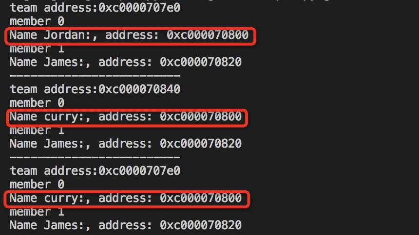
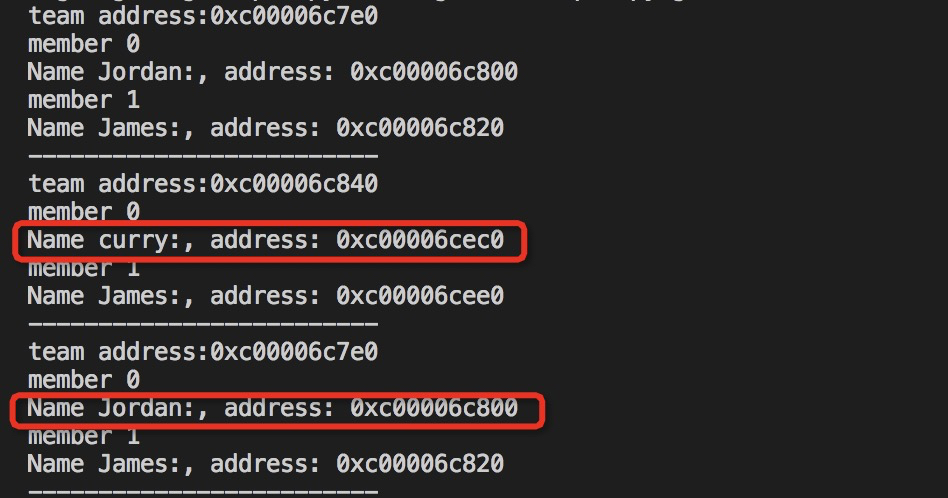
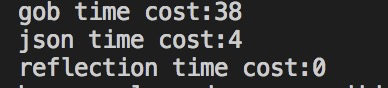

[[toc]]

# 要解决的问题

* 如何对GO中的结构体进行"深"拷贝

# 解决方案

分析Golang中对结构体进行"深"拷贝的不同方法。

# 解决方案案例

## Golang 结构体"深"拷贝方法
    

### 何时需要对结构体进行"深"拷贝？

Golang中参数传递的思想是**按值传递**。因此，赋值的操作也是**按值拷贝**的。如果一个结构体的成员变量都是简单类型，且无指针，那对于这个结构体的拷贝只需简单的一个赋值语句即可，暂将其称为**浅拷贝**。但若是结构体中有指针，那么浅拷贝操作就需要注意

```$xslt

type Team struct {
	Group []*Member `json:"group"`
}

type Member struct {
	Name string `json:"name"`
	Age  int    `json:"age"`
}

// "浅"拷贝
func shallowCopy(teamA *Team) {
	showTeam(teamA)
	teamB := &Team{}
	*teamB = *teamA
	teamB.Group[0].Name = "curry"
	showTeam(teamB)
	showTeam(teamA)
}
```

结果如下



可见对于teamB的操作影响到了teamA。如若对于teamB的操作影响不了teamA，则将其称为深拷贝。在C++中，可以使用memcpy函数来完成深拷贝；在

### 深拷贝方法一：序列化

将结构体(或者说对象)进行序列化是很多语言深拷贝的常用方式。

#### json序列化

```$xslt

buffer, _ := json.Marshal(&teamA)
json.Unmarshal([]byte(buffer), teamB)
```

#### gob序列化

```$xslt

gob.NewEncoder(buffer).Encode(*teamA)
gob.NewDecoder(bytes.NewBuffer(buffer.Bytes())).Decode(teamB)

```

一般而言序列化使用json就足够了，且当结构体较小时，json序列化的效率远高于gob。gob只在某些场景下的效率高于json。

### 深拷贝方法二：反射

使用reflect包实现深拷贝(序列化的底层实现也用到了反射)。

#### json序列化

```$xslt

// 使用反射，迭代地进行拷贝
func copyRecursive(original, cpy reflect.Value) {
	switch original.Kind() {
	case reflect.Ptr:
		// 获取指针所指的实际值，并拷贝给cpy
		originalValue := original.Elem()
		cpy.Set(reflect.New(originalValue.Type()))
		copyRecursive(originalValue, cpy.Elem())

	case reflect.Struct:
		// 遍历结构体中的每一个成员
		for i := 0; i < original.NumField(); i++ {
			copyRecursive(original.Field(i), cpy.Field(i))
		}

	case reflect.Slice:
		// 在cpy中创建一个新的切片，并使用一个for循环拷贝
		cpy.Set(reflect.MakeSlice(original.Type(), original.Len(), original.Cap()))
		for i := 0; i < original.Len(); i++ {
			copyRecursive(original.Index(i), cpy.Index(i))
		}

	default:
		// 真正的拷贝操作
		cpy.Set(original)
	}
}
```

<<< @/golang-deep-copy/deep_copy.go

各深拷贝方法结果如下



### 方法比较

对序列化方法和反射方法做一个简单的对比。
各执行100,0000次的耗时(秒)



### 总结

- 大多数情况下，使用序列化即可。
- 在追求速度的情况下，可选择自己使用反射实现深拷贝。

### 参考资料

[使用序列化实现深拷贝](https://www.jianshu.com/p/f1cdb1bc1b74)
[使用反射实现深拷贝](https://github.com/mohae/deepcopy)