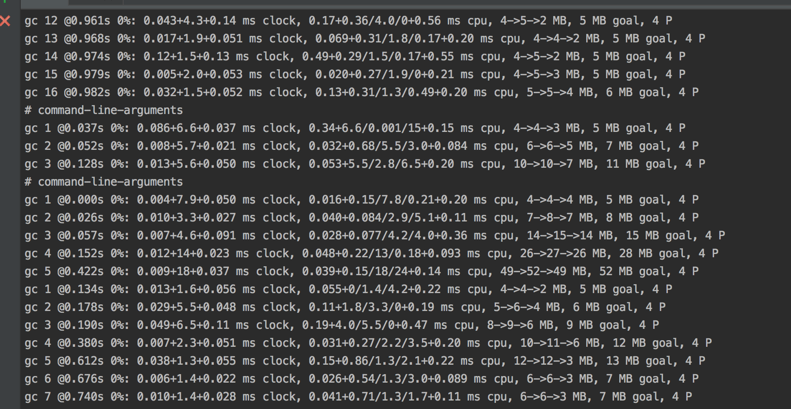
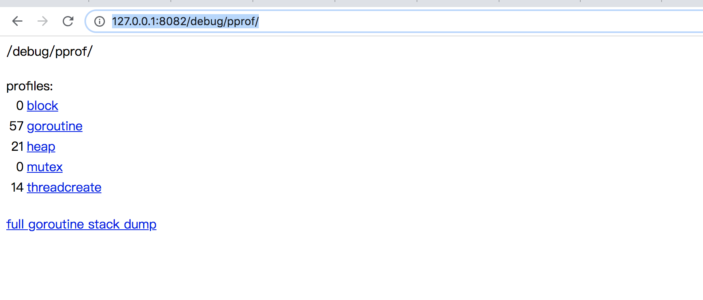
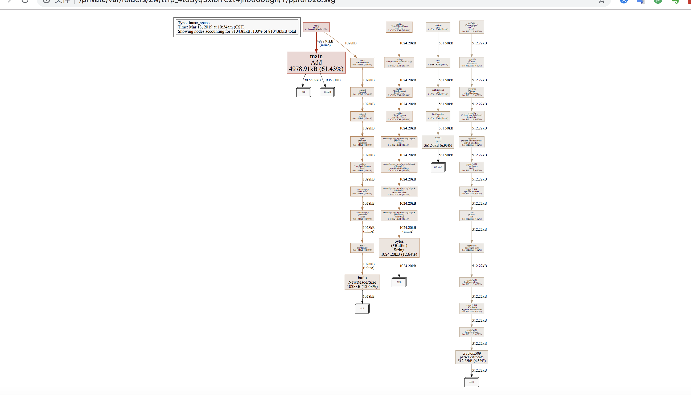

[[toc]]

# 要解决的问题

* 如何解决Golang垃圾的回收问题

# 解决方案

对Golang垃圾回收原理进行剖析，并通过实战样例分析来定位GC问题，从而掌握优化思路。


# 解决方案案例

## Golang GC原理剖析
    

### 何时触发GC？

1.  在申请内存的时候，检查当前当前已分配的内存是否大于上次GC后的内存的2倍，若是则触发（主GC线程为当前M）
2.  监控线程发现上次GC的时间已经超过两分钟了，触发；将一个G任务放到全局G队列中去。（主GC线程为执行这个G任务的M）


### 垃圾回收流程
详细过程如下图：


####说明：

- mark 有两个过程。
  - 从 root 开始遍历，标记为灰色。遍历灰色队列。
  - re-scan 全局指针和栈。因为 mark 和用户程序是并行的，所以在过程 1 的时候可能会有新的对象分配，这个时候就需要通过写屏障（write barrier）记录下来。re-scan 再完成检查一下。

- Stop The World 有两个过程。
  - 第一个是 GC 将要开始的时候，这个时候主要是一些准备工作，比如 enable write barrier。
  - 第二个过程就是上面提到的 re-scan 过程。如果这个时候没有 stw，那么 mark 将无休止。
  
- 回收过程目前是可以并行执行执行 

<<< @/../golang-garbage-collection/gc_m.cpp


### 如何确定哪些对象需要回收？
Golang GC 垃圾回收算法采用的是三色标记法，原理如下:
 
    1. 初始所有对象都是白色
    2. 从root（包含全局指针和goroutine栈上指针）出发扫描所有的可达对象，将可达对象标记为灰色，放入对处理队列
    3. 从队列中取出所有的灰色对象，将这轮灰色对象所引用的对象标记为灰色放入队列，并将自己标记成黑色
    4. 重复3，直到灰色队列为空。此时剩余的白色对象即为垃圾，执行回收。
 
 

### 三色标记法缺点，golang 怎么来解决这个问题?

- 缺点:可能程序中的垃圾产生的速度会大于垃圾收集的速度，这样会导致程序中的垃圾越来越多无法被收集掉。

- 解决思路:go 除了标准的三色收集以外，还有一个辅助回收功能，防止垃圾产生过快手机不过来的情况。这部分代码在 runtime.gcAssistAlloc 中

### 为什么做写屏障？
对于和用户程序并发运行的垃圾回收算法，用户程序会一直修改内存，所以需要记录下来。


## Golang GC 优化实战样例

### gctrace 跟踪实时的gc

- 实验代码：
 <<< @/../golang-garbage-collection/pprof_study.go

- 启动gctrace
```$xslt
GODEBUG=gctrace=1  go run pprof_study.go
//GODEBUG=gctrace=1 ./main
```
- 效果如下图:



说明:
```$xslt
gc 5 @0.422s 0%: 0.009+18+0.037 ms clock, 0.039+0.15/18/24+0.14 ms cpu, 49->52->49 MB, 52 MB goal, 4 P


gc 5 代表第5次执行
@0.422s  这次GC之前程序已经运行的总时间
0% 垃圾回收时间占用的百分比，
0.009+18+0.037 ms clock垃圾回收的时间，几个时间依次是STW清扫的时间，并发标记和扫描的时间，STW标记时间
0.039+0.15/18/24+0.14 ms cpu  垃圾回收占用cpu时间
49->52->49 MB 堆的大小，gc后堆的大小，存活堆的大小
52 MB goal 整体堆的大小
4 P  使用的处理器数量
```
gctrace 能初步帮忙了解到gc执行的时间，次数，堆空间大小等宏观参数，但是无法帮助我们排查对于具体是那个方法，
哪个地方导致消耗大量内存以及造成无法回收,那该如何具体定位gc问题呢？

### pprof 定位具体gc问题

- 使用，在你的程序加入以下代码
```$xslt

import (
	_ "net/http/pprof"
	"net/http"
	"log"
)
go func() {

        //ip:port 依据自己情况而定
		log.Println(http.ListenAndServe("localhost:8082", nil))
	}()
```


- 在浏览器中输入 -http://127.0.0.1:8082/debug/pprof/- 即可得到:


也可以结合go tool 做更细致的操作
```$xslt
go tool pprof  http://127.0.0.1:8082/debug/pprof/heap       //查看堆的使用，即内存使用情况
go tool pprof  http://127.0.0.1:8082/debug/pprof/profile    //查看cpu耗时，会详细列出每个函数的耗时
go tool pprof  http://127.0.0.1:8082/debug/pprof/goroutine  //当前在运行的goroutine情况以及总数
```


```
go tool pprof  http://127.0.0.1:8082/debug/pprof/heap
Fetching profile over HTTP from http://127.0.0.1:8082/debug/pprof/heap
Saved profile in /Users/didi/pprof/pprof.alloc_objects.alloc_space.inuse_objects.inuse_space.013.pb.gz
Type: inuse_space
Time: Mar 13, 2019 at 10:34am (CST)
Entering interactive mode (type "help" for commands, "o" for options)
(pprof) top20
Showing nodes accounting for 8104.83kB, 100% of 8104.83kB total
Showing top 20 nodes out of 38
      flat  flat%   sum%        cum   cum%
 4978.91kB 61.43% 61.43%  4978.91kB 61.43%  main.Add
    1028kB 12.68% 74.12%     1028kB 12.68%  bufio.NewReaderSize (inline)
 1024.20kB 12.64% 86.75%  1024.20kB 12.64%  bytes.(*Buffer).String
  561.50kB  6.93% 93.68%   561.50kB  6.93%  html.init
  512.22kB  6.32%   100%   512.22kB  6.32%  crypto/x509.parseCertificate
         0     0%   100%     1028kB 12.68%  bufio.NewReader (inline)
         0     0%   100%     1028kB 12.68%  bytes.(*Buffer).ReadFrom
         0     0%   100%     1028kB 12.68%  compress/gzip.(*Reader).Reset
         0     0%   100%     1028kB 12.68%  compress/gzip.NewReader
         0     0%   100%   512.22kB  6.32%  crypto/tls.(*Conn).Handshake
         0     0%   100%   512.22kB  6.32%  crypto/tls.(*Conn).clientHandshake
         0     0%   100%   512.22kB  6.32%  crypto/tls.(*clientHandshakeState).doFullHandshake
         0     0%   100%   512.22kB  6.32%  crypto/tls.(*clientHandshakeState).handshake
         0     0%   100%   512.22kB  6.32%  crypto/x509.(*CertPool).AppendCertsFromPEM
         0     0%   100%   512.22kB  6.32%  crypto/x509.(*Certificate).Verify
         0     0%   100%   512.22kB  6.32%  crypto/x509.ParseCertificate
         0     0%   100%   512.22kB  6.32%  crypto/x509.initSystemRoots
         0     0%   100%   512.22kB  6.32%  crypto/x509.loadSystemRoots
         0     0%   100%   512.22kB  6.32%  crypto/x509.systemRootsPool
         0     0%   100%   561.50kB  6.93%  html/template.init
(pprof) web
(pprof) 

```
flat代表单个函数的运行时间，而cum则是累加的时间 使用web 就会将在浏览器上展示内存消耗调用栈svg矢量图,图中框颜色越深内存消耗越大

web命令 是生成一张svg图然后再浏览器中展示
效果如下图：

ps:如果想结合图形查看则需要安装graphviz
  
    - mac: brew install graphviz
    
    - centos: yum install graphviz

上图中 main.Add 中的颜色较深，我们用peek 来看下调用关系

```$xslt
(pprof) peek Add
Showing nodes accounting for 8104.83kB, 100% of 8104.83kB total
----------------------------------------------------------+-------------
      flat  flat%   sum%        cum   cum%   calls calls% + context              
----------------------------------------------------------+-------------
                                         4978.91kB   100% |   main.doTask (inline)
 4978.91kB 61.43% 61.43%  4978.91kB 61.43%                | main.Add
----------------------------------------------------------+-------------

```
main.doTask 100%调用main.Add方法,并切内存百分比达到61.43% ,接下来我们用list 命令跟下main.doTask 和main.Add源码

```$xslt
(pprof) list main.doTask
Total: 7.91MB
ROUTINE ======================== main.doTask in /Users/didi/mygo/src/github.com/agnees/studygo/pprof_study.go
         0     5.87MB (flat, cum) 74.12% of Total
         .          .     48:func doTask(waitGroup *sync.WaitGroup) {
         .          .     49:
         .          .     50:   for {
         .          .     51:
         .          .     52:           for i:= 0 ;i<10000;i++{
         .     2.86MB     53:                   Add("hello world ! just do it!")
         .        1MB     54:                   len := doHttpRequest()
         .          .     55:
         .        2MB     56:                   Add(fmt.Sprintf("response length %v",len))
         .          .     57:           }
         .          .     58:
         .          .     59:           time.Sleep(3 * time.Second)
         .          .     60:   }
         .          .     61:   waitGroup.Done()


(pprof) list Add
Total: 7.91MB
ROUTINE ======================== main.Add in /Users/didi/mygo/src/github.com/agnees/studygo/pprof_study.go
    4.86MB     4.86MB (flat, cum) 61.43% of Total
         .          .     63:
         .          .     64:var datas []string
         .          .     65:
         .          .     66:func Add(str string) string {
         .          .     67:   data := []byte(str)
       3MB        3MB     68:   dataStr := string(data)
    1.86MB     1.86MB     69:   datas = append(datas, dataStr)
         .          .     70:   return dataStr
         .          .     71:}


 list doHttpRequest
Total: 7.91MB
ROUTINE ======================== main.doHttpRequest in /Users/didi/mygo/src/github.com/agnees/studygo/pprof_study.go
         0        1MB (flat, cum) 12.68% of Total
         .          .     35:   resp, err := http.Get("http://www.alibaba.com")
         .          .     36:   if err != nil {
         .          .     37:
         .          .     38:   }
         .          .     39:
         .        1MB     40:   bytes, e := ioutil.ReadAll(resp.Body)
         .          .     41:   if e != nil {
         .          .     42:
         .          .     43:   }
         .          .     44:   result = append(result,string(bytes))
         .          .     45:   return len(bytes)
(pprof) list ReadAll

```
可以看出 append 方法占用1.86MB string（data）占用了3MB，初步可以看来:

    1. slice会频繁扩容
    2. byte 数组与string转换导致
   
doHttpRequest 中ioutil.ReadAll为什么也会内存占用这么多？


- 结合go build -gcflgs=-m 做逃逸分析
  
 ```$xslt
bogon:studygo didi$ go build --gcflags=-m pprof_study.go
# command-line-arguments
./pprof_study.go:66:6: can inline Add
./pprof_study.go:53:7: inlining call to Add
./pprof_study.go:56:7: inlining call to Add
./pprof_study.go:40:33: resp.Body escapes to heap
./pprof_study.go:44:31: string(bytes) escapes to heap
./pprof_study.go:34:20: doHttpRequest []string literal does not escape
./pprof_study.go:53:7: string(data) escapes to heap
./pprof_study.go:56:20: len escapes to heap
./pprof_study.go:56:7: string(data) escapes to heap
./pprof_study.go:48:24: leaking param: waitGroup
./pprof_study.go:53:7: doTask ([]byte)(str) does not escape
./pprof_study.go:56:19: doTask ... argument does not escape
./pprof_study.go:56:7: doTask ([]byte)(str) does not escape
./pprof_study.go:16:11: waitGroup escapes to heap
./pprof_study.go:15:2: moved to heap: waitGroup
./pprof_study.go:19:13: &waitGroup escapes to heap
./pprof_study.go:22:5: func literal escapes to heap
./pprof_study.go:22:5: func literal escapes to heap
./pprof_study.go:28:11: waitGroup escapes to heap
./pprof_study.go:24:34: http.ListenAndServe("localhost:8082", nil) escapes to heap
./pprof_study.go:24:14: main.func1 ... argument does not escape
./pprof_study.go:68:19: string(data) escapes to heap
./pprof_study.go:66:22: Add str does not escape
./pprof_study.go:67:16: Add ([]byte)(str) does not escape

```

结果发现 resp.Body 被分配到堆上，可以初步定为可能是http body没有close掉导致频繁GC

我们再来看下profile中调用栈gc耗时时间

 
 
 
果不其然确实是resp.Body未被关闭导致频繁GC

- 总结 在高频请求下
    
    - 函数尽量不要返回map， slice对象, 这种频繁调用的函数会给gc 带来压力。

    - 小对象要合并。

    - 函数频繁创建的简单的对象，直接返回对象，效果比返回指针效果要好。

    - 避不开，能用sync.Pool 就用，虽然有人说1.10 后不推荐使用sync.Pool，但是压测来看，确实还是用效果，堆累计分配大小能减少一半以上。

    - 避免反复创建slice。
    
    - [http response body 需要被关闭](https://www.jianshu.com/p/407fada3cc9d)

 