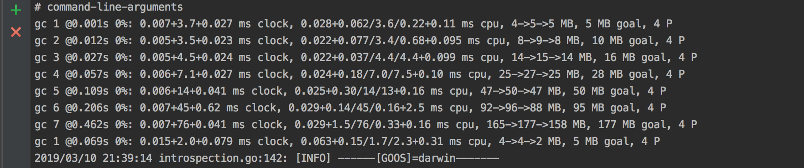

[[toc]]

# 要解决的问题

* 如何解决Golang垃圾的回收问题

# 解决方案

对Golang垃圾回收原理进行剖析，并通过实战样例分析来定位GC问题，从而掌握优化思路。


# 解决方案案例

## Golang GC原理剖析
    

### 何时触发GC？

1.  在申请内存的时候，检查当前当前已分配的内存是否大于上次GC后的内存的2倍，若是则触发（主GC线程为当前M）
2.  监控线程发现上次GC的时间已经超过两分钟了，触发；将一个G任务放到全局G队列中去。（主GC线程为执行这个G任务的M）


### 垃圾回收流程
详细过程如下图：


####说明：

- mark 有两个过程。
  - 从 root 开始遍历，标记为灰色。遍历灰色队列。
  - re-scan 全局指针和栈。因为 mark 和用户程序是并行的，所以在过程 1 的时候可能会有新的对象分配，这个时候就需要通过写屏障（write barrier）记录下来。re-scan 再完成检查一下。

- Stop The World 有两个过程。
  - 第一个是 GC 将要开始的时候，这个时候主要是一些准备工作，比如 enable write barrier。
  - 第二个过程就是上面提到的 re-scan 过程。如果这个时候没有 stw，那么 mark 将无休止。
  
- 回收过程目前是可以并行执行执行 

<<< @/golang-garbage-collection/gc_m.cpp


### 如何确定哪些对象需要回收？
Golang GC 垃圾回收算法采用的是三色标记法，原理如下:
 
    1. 初始所有对象都是白色
    2. 从root（包含全局指针和goroutine栈上指针）出发扫描所有的可达对象，将可达对象标记为灰色，放入对处理队列
    3. 从队列中取出所有的灰色对象，将这轮灰色对象所引用的对象标记为灰色放入队列，并将自己标记成黑色
    4. 重复3，直到灰色队列为空。此时剩余的白色对象即为垃圾，执行回收。
 
 

### 三色标记法缺点，golang 怎么来解决这个问题?

- 缺点:可能程序中的垃圾产生的速度会大于垃圾收集的速度，这样会导致程序中的垃圾越来越多无法被收集掉。

- 解决思路:go 除了标准的三色收集以外，还有一个辅助回收功能，防止垃圾产生过快手机不过来的情况。这部分代码在 runtime.gcAssistAlloc 中

### 为什么做写屏障？
对于和用户程序并发运行的垃圾回收算法，用户程序会一直修改内存，所以需要记录下来。


## Golang GC 优化实战样例

### gctrace 跟踪实时的gc
 
- 启动gctrace
```$xslt
GODEBUG=gctrace=1  go run main.go
//GODEBUG=gctrace=1 ./main
```
- 效果如下图:



说明:
```$xslt
gc 1 @0.001s 0%: 0.007+3.7+0.027 ms clock, 0.028+0.062/3.6/0.22+0.11 ms cpu, 4->5->5 MB, 5 MB goal, 4 P

gc 1 代表第一次执行
@0.001s  这次GC之前程序已经运行的总时间
0% 垃圾回收时间占用的百分比，
0.007+3.7+0.027 ms clock垃圾回收的时间，几个时间依次是STW清扫的时间，并发标记和扫描的时间，STW标记时间
0.028+0.062/3.6/0.22+0.11 ms cpu  垃圾回收占用cpu时间
4->5->5 MB 堆的大小，gc后堆的大小，存活堆的大小
5 MB goal 整体堆的大小
4 P  使用的处理器数量
```
gctrace 能初步帮忙了解到gc执行的时间，次数，堆空间大小等宏观参数，但是无法帮助我们排查对于具体是那个方法，
哪个地方导致消耗大量内存以及造成无法回收,那该如何具体定位gc问题呢？

### pprof 定位具体gc问题

- 使用，在你的程序加入以下代码
```$xslt

import (
	_ "net/http/pprof"
	"net/http"
	"log"
)
go func() {

        //ip:port 依据自己情况而定
		log.Println(http.ListenAndServe("localhost:8082", nil))
	}()
```

- 在浏览器中输入 -http://127.0.0.1:8082/debug/pprof/- 即可得到下图:


也可以结合go tool 做更细致的操作
```$xslt
go tool pprof  http://127.0.0.1:8081/debug/pprof/heap       //查看堆的使用，即内存使用情况
go tool pprof  http://127.0.0.1:8081/debug/pprof/profile    //查看cpu耗时，会详细列出每个函数的耗时
go tool pprof  http://127.0.0.1:8081/debug/pprof/goroutine  //当前在运行的goroutine情况以及总数
```


