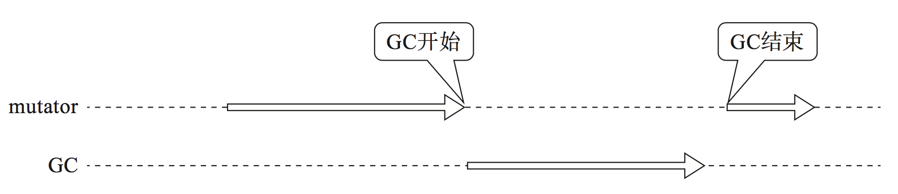
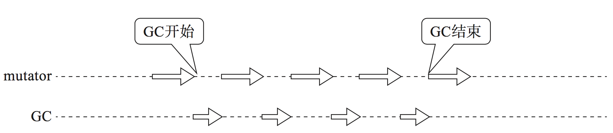

# 要解决的问题

* 如何降低垃圾回收的最大暂停时间

# 解决方案

* 增量式垃圾回收

* 并发

# 解决方案案例

## Golang 垃圾回收的优化

Golang 1.1 版本采用标记清除算法实现垃圾回收，标记阶段采用深度优先算法递归地标记活动对象，清除阶段顺序遍历堆，将未标记的对象添加到空闲链表。collector 线程执行一气呵成完成标记和清除过程，期间 mutator 线程需要暂停运行，STW 时长在秒级别。对于实时交互的应用场景，秒级别的 mutator 暂停时间是难以承受的。在 1.3 版本中通过并发技术优化清除阶段的时间。在 1.5 版本中通过三色标记-清除算法增量地进行垃圾回收。Golang 1.7 版本中 mutator 的暂停时间已经控制在 1ms 左右。三色标记清除算法是把标记和清除阶段划分为多个步骤，每个步骤指定步长，小步快跑的方式进行回收，mutator 和 collector 之间是交替式执行的。

STW 方式的GC：



增量式 GC：



#### 三色标记-清除算法

将垃圾回收过程划分为3个子阶段，利用黑、灰、白三种颜色标记对象所处的标记状态和活动状态。由于每个阶段结束后，collector 将控制权交给 mutator，允许 mutator 继续运行程序，可以有效减少 mutator 暂停时间。

三种颜色：

白色：还未搜索过的对象
灰色：正在搜索的对象
黑色：搜索完成的对象

三个阶段：

根查找阶段：将根直接指向对象标记成灰色
标记阶段：将子对象涂成灰色，结束时候所有对象都是黑色
清除阶段：查找清除白色对象连接到空闲链表。将黑色对象变为白色对象。

三色标记清除垃圾回收的伪代码如下:

```
incremental_gc(){
    case $gc_phase     // 全局变量 gc_phase 标记当前垃圾回收所处的阶段
    when GC_ROOT_SCAN  
        root_scan_phase()
    when GC_MARK  
        incremental_mark_phase()
    else
        incremental_sweep_phase() 
    
}
```

在根查找阶段，collector 遍历根直接引用到的对象，将它们打上灰色标记，放入栈中，利用栈来存放灰色对象。遍历结束后，collector 将 gc_phase 设置为 GC_MARK，调度程序将控制权交给 mutator 线程运行。

下次执行垃圾回收 incremental_gc() 函数时，执行进行标记阶段的处理。标记阶段从栈中取出灰色对象进行打色标记，这也是一个增量的过程，每次只处理一定数量的灰色对象后就将控制权继续交回给 mutator，避免一次性处理所有灰色对象导致 mutator 暂停时间过长。当栈中所有灰色对象都被处理后，将 gc_phase 设置为 GC_SWEEP。

之后再进入 incremental_gc 时，进入清除阶段，incremental_sweep_phase 函数每次只清除堆中一定数量的白色对象，然后将控制权交给 mutator。

##### 根查找阶段

遍历根直接引用到的对象，打上灰色标记：

```
root_scan_phase(){
    for(r : $roots)
        mark(*r)
    $gc_phase = GC_MARK
}
```

mark 函数将对象打上标记，并放入栈中暂存。未标记的即为白色，标记之后是灰色。

```
mark(obj){
    if(obj.mark == FALSE)
        obj.mark = TRUE
        push(obj, $mark_stack)
}
```

根查找阶段结束后，所有通过根直接引用到的对象被标记为灰色，并暂存在栈中，然后 mutator 可以继续运行。

##### 标记阶段

通过 MARK_MAX 参数控制步长，每次只处理栈中一定数量的灰色对象，体现增量地标记过程。

```
incremental_mark_phase(){
    for(i :1...MARK_MAX)
        if(is_empty($mark_stack) == FALSE) //从栈中取出对象，将其子对象涂成灰色。
            obj = pop($mark_stack)
            for(child :children(obj))
                mark(*child) // 递归涂子孩子。
        else
            for(r :$roots) // 再次对根直接引用的对象进行标记。因为根查找阶段之后，mutator 运行中可能产生新的对象，根的引用关系已经发生变化。
                mark(*r)
            while(is_empty($mark_stack) == FALSE)
                obj = pop($mark_stack)
                for(child :children(obj))
                    mark(*child)
            
            $gc_phase = GC_SWEEP // 标记阶段结束，可以进入清除阶段
            $sweeping = $heap_start
            return           
}
```

值得注意的是，collector 进行根查找阶段结束后，由 mutator 继续运行，期间可能会分配新的活动对象，或者对象之间的引用指针发生更新，collector 在进入标记阶段时，如果不处理这些情况，会导致错误地回收正在活动对象，引发程序 bug。因此，对于新分配的活动对象，在标记阶段的最后一步可以通过再次遍历根来解决。而对于对象之间引用关系发生更新的情况，通过写入屏障（write_barrier）的方法来解决。

###### 衍生的问题:

* [如何解决并发垃圾回收导致的同步问题](cms-write-barrier.md)

##### 清除阶段

进入清除阶段时，遍历堆，把堆中没有标记的对象加入到空闲链表，重置存在标记的对象的标记位。每次清除，只清除一定数量的对象，然后暂停，由 mutator 继续运行。
当遍历到堆的尾部时，清除完成，意味着一次完整的垃圾标记清除过程完成。将 gc_phase 设置为 GC_ROOT_SCAN，开始下一轮的垃圾标记清除过程。

```
incremental_sweep_phase(){
    swept_count = 0
    while(swept_count < SWEEP_MAX)
        if($sweeping < $heap_end)
            if($sweeping.mark ==TRUE)
                $sweeping.mark = FALSE
            else
                $sweeping.next = $free_list
                $free_list = $sweeping
                $free_size += $sweeping.size
            $sweeping += $sweeping.size
            swept_count++
        else
        $gc_phase = GC_ROOT_SCAN
        return 
        
}
```

##### 分配

mutator 运行过程中，进行对象分配时，检查是否满足垃圾回收的阈值条件。

```
newobj(size){
    if($free_size < HEAP_SIZE * GC_THRESHOLD)
        incremental_gc()
    
    chunk = pickup_chunk(size, $free_list)
    if(chunk != NULL)
        chunk.size = size
        $free_size -= size
        if($gc_phase == GC_SWEEP && $sweeping <= chunk) // 判断GC是否在清除阶段和chunk是不是在已清除完毕的空间
            chunk.mark = TRUE  // 没有在清除完毕的空间，我们要设置标志位
        return chunk
    else
        allocation_fail()
}
```